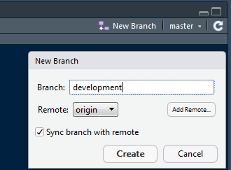
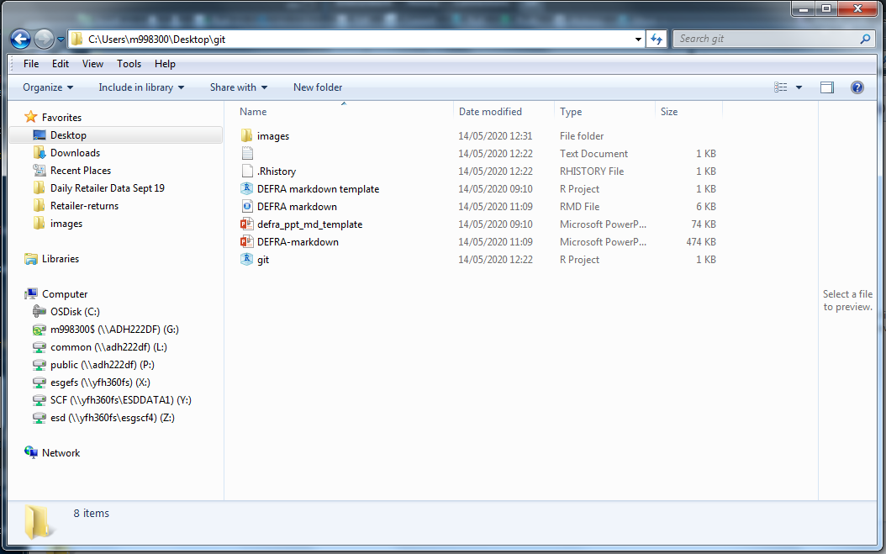
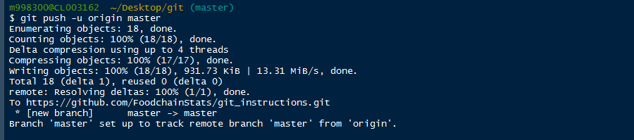

```{r setup, include=FALSE}
knitr::opts_chunk$set(echo = TRUE, eval = FALSE)
```


# Why use git?

* *Version control is an essential part of good data science practice.*
* `git` will document changes as you go along and allow unfavourable changes to be rolled back. 
* Without `git`, If you have a large amount of code, say an ` R shiny ` app, and someone deletes a comma or a curly bracket then saves it; the whole product could fall over and you might never find the bug.
* It allows multiple users to modify code at the same time. This is especially useful for report writing using `rMarkdown`.
* It allows you to deploy packages which can be easily installed to support reproducible pipelines. 


# Starting Point

* These instructions assume that you have `R` and `RStudio` installed and can install packages.

* [You will also need to create a github account](https://github.com/).


# Git Installation and Config


## Instructions

* Can be installed manually from the website or simply with the `installr` package available on CRAN.
* This code will download the latest version of git and begin the installation process. 

```{r, eval=FALSE,echo=TRUE}
# With the package installr installed, run this code to install git.
installr::install.git()
```

* Enable symbolic links during install.


* Open the terminal in RStudio. If you can't find it, you can always get to it here.


* You can configure `git` to remember your username, password and the settings to work with DEFRA's proxy server. 

* Replace `your_username` and `your_password` below with your credentials for github.com.

* __This code must be run in the terminal in `RStudio` or in `git bash`__. Not the `R` console itself. It's not `R` code.

```{bash, eval=FALSE,echo=TRUE}
git config --global http.proxy 148.253.235.216:80
git config --global user.name your_username
git config --global user.password your_password
```

# Overview

  * __Scenario 1:__ There is code on github.com and you want it on your laptop.
  * __Scenario 2:__ There is code on github.com and you want to collaborate/develop it, syncing your changes back to github.com.
  * __Scenario 3:__ You are starting a new project and you want to use git for version control.
  * __Scenario 4:__ You have code on your laptop you want to put on github.com.
  * __Scenario 5:__ You want to install an `R` package from github.
  * __Scenario 6:__ You want to work with code located on a private repo.
  * __Appendix__
    * Troublshooting HTTP errors.
    * Updating/installing `R`.
    * Updating/installing `RStudio`.


# Scenario 1: Cloning code from github.com into a folder on your laptop

* There is code on github.com and you want it on your laptop.


## Instructions

1. Open `RStudio `
2. Pass the URL of the target `git` repo to a `git clone` call in the terminal (not the console) as below. 
```{bash, eval=FALSE,echo=TRUE}
git clone https://github.com/FoodchainStats/git_instructions
```

3. This will enable you to download a repository from github into whatever project you are currently working on.
    + Unlike the process in Scenario 2 it doesn't set up version control or require you to create a new project, it just grabs the code.


4. You can use `git clone` like this to quickly download code from online repositories.


# Scenario 2: There is code on github.com and you want to develop it.

* The repo you want to clone into a project using version control


## Instructions

1. Open `RStudio `.
2. Click 'New Project'.


3. Select “Version Control”.


4. Click the "Git" option to clone a project from a `git` repository.


5. Paste in the URL of the `git` repository you wish to collaborate in and click "Create Project"


6. `RStudio ` will now download the code and restart into the new project with `git` tracking any changes you make.

7. When working collaboratively, it is best practice to create your own branch (a copy) to work from.
    + This means if you make a change that accidentally breaks the code, it won't automatically mess it up for the other users.
    
8. Click 'New Branch' in `RStudio ` and give your new branch a name e.g. "development".



9. A window like this should pop up, describing the successful creation of a branch.


10. After making your changes, in the "Git" tab. Click commit.


11. Select your file/s by double clicking them or clicking the stage button with them highlighted. The tick box should appear checked.


12. Type a commit message and click commit then close.


13. Click the push button with the green up arrow.


14. If the push was successful, your terminal should display something like this.


15. In your browser, navigate to the repository URL and you should see a compare and pull request button. Click it.


16. Here you can describe the changes you have made in further detail and submit a request that your changes be integrated.


17. If your new changes can be safely integrated i.e. they do not conflict with changes already made to the master branch, you will see an indication that you are able to merge. Clicking the merge pull request button will integrate your changes.


18. This will have merged your changes with the online master branch.

### Notes

* It might seem like a long winded process but if the code is important, you don't want accidental changes to be a possibility.
* If you are not working collaboratively, and it is your project, you can commit directly to the master branch. But otherwise it is best practice to work from development branches as outlined here.

# Scenario 3: Starting a new project with git


## Instructions

1. Log in to GitHub <https://github.com/login> with your github username and password.


2. Click 'New' to create a new repository on github.com
 

 
 
3. Enter project name 
4. Choose visibility level
    * Think about whether there is anything potentially sensitive about your project. If in doubt, make your repo Private.
    * This can be changed at any point if you decide you want to make your private repo public.
 

 

5. If you have successfully created a repo, you'll see something like this:


6. Open `RStudio `.
7. Click 'New Project'.


8. Select “Version Control”.


9. Click the "Git" option.


5. Paste in the URL of the `git` repository you have just created.


6. `RStudio ` will now download the code and restart into the new project with `git` tracking any changes you make.

10. After writing some code and saving your `.r` script, in the "Git" tab. Click commit.


11. Select your file/s by double clicking them or clicking the stage button with them highlighted. The tick box should appear checked.


12. Type a commit message and click commit then close.


13. Click the push button with the green up arrow.


14. If the push was successful, your terminal should display something like this.


15. In your browser, if you refresh your repository URL you should now see your that your project has been uploaded.


# Scenario 4: Pushing existing code to a new repo on github

* You have code on your laptop you want to put on github.com




## Instructions

1. Open `RStudio `.
2. Click 'New Project'.
3. Select “Existing directory” then navigate to the directory of your project and select OK.
 

 

4. Log in to GitHub <https://github.com/login> with your github username and password.


5. Click 'New' to create a new repository on github.com
 

 
 
6. Enter project name 
7. Choose visibility level
    * Think about whether there is anything potentially sensitive about your project. If in doubt, make your repo Private.
    * This can be changed at any point if you decide you want to make your private repo public.
 

 

8. If you have successfully created a repo, you'll see something like this:


9. Back in `RStudio `, click Tools > Version Control > Project Setup


10. Select `git` as your version control system for this project.


11. Select "Yes" when it asks if you want to initialize a new repository.


12. Select "Yes" when it asks if you want to restart `RStudio `.


13. `RStudio ` will restart and you will now be able to see the "Git" tab. Under that will be all the files in your project that are being tracked by `git`.
  * The "Push" and "Pull" buttons will still be greyed out at this point.  


14. You now need to enter a line of code from the repository URL into the terminal in `RStudio `.


15. The line will begin `git remote add origin` and be followed by the URL of your repository.


```{bash, eval=FALSE,echo=TRUE}
git remote add origin https://github.com/FoodchainStats/git_instructions.git
```

16. It should look like this in the terminal, it doesn't return anything.


  * You can check that it worked the by entering the following code in terminal:
```{bash, eval=FALSE,echo=TRUE}
git remote -v
```

  * Alternatively you can check that it worked under Tools > Version Control > Project Setup.
  
17. The Origin should now be set to the URL of your git repository.


18. If you make a mistake, the URL can be changed later with the `set-url` command by modifying the code below.

```{bash, eval=FALSE,echo=TRUE}
git remote set-url origin https://github.com/USERNAME/REPOSITORY.git
```

19. With the URL set you can now commit your files ready for upload. Select your file/s by double clicking them or clicking the stage button with them highlighted. The tick box should appear checked. 

20. Type a commit message and click commit then close.


21. In the terminal, run the following code to sync your changes with the online repository.

```{bash, eval=FALSE,echo=TRUE}
git push -u origin master
```


22. If the push operation worked, you should see something like this.



23. You should now be able to see your file in your GitHub repository by pressing the refresh button in your browser.

24. Additionally, the push and pull arrows shouldn’t be greyed out any longer in your `RStudio ` environment, if not, simply restart `RStudio ` and that should solve the issue.


# Scenario 5: Install an R package from github.

* You want to install an `R` package from github. Either because it's not on cran, the cran version won't install with your version of `R` or because the github version is newer than the cran version.


## Instructions

1. You need to configure `R` to work with DEFRA's proxy in order to connect to the GitHub API and install packages.
2. This process doesn't actually require you to have `git` installed on your machine.
3. It does require you to install the `R` package `devtools`.
4. Modify the code below with your DEFRA username and password. The code will install `devtools` if you don't already have it. Then it will lookup and mimic the system proxy settings on Windows as set by Internet Explorer, combine them with your log in credentials and store the result as a temporary environment variable.
5. With the environment variable set it will then use the `devtools::install_github()` function to download the Demeter package from github.com which will make this process easier in the future.

```r
  #Install the package "devtools" if you don't already have it
if (!require("devtools")) install.packages("devtools")
  #Enter your username
username<-"your demeter username"
  #Enter your password
password<-"your demeter password"
  #Generate proxy address
proxy_address<-paste0("http://",username,":",password,"@",stringr::str_split(curl::ie_get_proxy_for_url("https://github.com/"), ";")[[1]][1])
  #Create environment variable
Sys.setenv(http_proxy=proxy_address, https_proxy=proxy_address)
  #Install package
devtools::install_github("FoodchainStats/demeter")
```

6. During install, you may be prompted to update some of your packages like this:


7. With `Demeter` installed you can simply run the function below. It will ask you to log in with your DEFRA credentials and set the environment variable for the proxy.

```r
demeter::proxy_connect()
```

8. When prompted, enter your DEFRA username (your m number).


9. When prompeted, enter your DEFRA password.


10. With this function you can connect to any API using `R` whilst on the DEFRA network and install packages from github as you want using the `devtools` function `install_github()` as we did to install `Demeter.`

```r
#Install the shinycssloaders package from github
devtools::install_github("daattali/shinycssloaders")
```

# Scenario 6: Code located on a private repo.

## Instructions.


1. With `demeter` installed and the `proxy_connect()` function up and running, `devtools` can be used to install packages from github.However, you need to tell `devtools` you are allowed to access private repositories.

2. You do this with a personal access token (PAT).

```r
usethis::browse_github_pat()
```

3. This will take you to github and walk you through the process of generating a PAT. On the New Personal Access token page, a check box list called "Select Scopes" will show, make sure write:packages and read:packages are checked before proceeding.


4. A PAT will then be generated which looks something like this: `8c70fd8419398999c9ac5bacf3192882193cadf2`

```r
#This code will open your .renviron file.
usethis::edit_r_environ()
```
5. The above line of code will open your `.Renviron` file.

6. Add your PAT to your `.Renviron` file. You shouls create a line that looks like this: `GITHUB_PAT=8c70fd8419398999c9ac5bacf3192882193cadf2` But with your actual PAT rather than this example.

7. You need to leave an extra line empty at the end of your `.Renviron file` so make sure to leave a line break before saving. You need to restart `R` for the changes to come into effect.

# Glossary

The word Git is often used ambiguously to mean several closely related things. When Git is referred to in this document, the definitions below are used:

* __Git:__ A version-control system for tracking changes in source code during development. 
* __GitHub:__ The website where you store your code. 
* __GitHub Desktop:__ A GUI  for interfacing with Git.
* __Git Bash:__ The command prompt/terminal which you would use to interact between GitHub and your local copy of the code.
* __Repository:__ This is basically a folder containing the project you are working on. It will have it's own URL and it's own folder on your machine. Repo for short.
* __Branch:__ The version of the code you are working on. All repo's start with a master branch.
* __Pull:__ Fetch a branch and merge it with what you've got.
* __Stage:__ Prepare your changes to be stored. 
* __Commit:__
  * __Verb:__ The act of storing a new snapshot of your project.
  * __Noun:__ A single point in the history of your project, any snapshot you have taken. 
* __Push:__ Upload your changes to GitHub.

[More definitions can be found here.](https://git-scm.com/docs/gitglossary)

# Appendix

# Troubleshooting HTTP errors

* If you are consistently getting http error 407:
  * It is possible that the proxy address has changed, you can get the proxy address which will work for you by running this line in the `R` console, then update the git config like on the previous slide.
  
```{r, eval=FALSE,echo=TRUE}
stringr::str_split(curl::ie_get_proxy_for_url("https://github.com/"), ";")[[1]][1]
```

* If you are getting http error 404:
  * Double check the address of the repository you are trying to connect to, also check whether it is a secret repository. If it is, follow the instructions for secret repos.
  
# Updating R

* This is important if you haven’t recently. As of May. 2020 we’re up to R version 4.0.0. If the new version of R disagrees with you, you can always revert to the previous version via R studio > Tools > Global options so this isn’t as risky as it might seem. It’s easy with the package `installr`.

```{r, eval=FALSE,echo=TRUE}
installr::install.R()
```

* __By updating R you must also update/reinstall all of your packages as well.__

* Make sure you set the default installation directory to somewhere you have full rights over e.g. your user directory on the C drive. __Don’t install it to your network drive or it will be very slow__.

* When connected to the DEFRA ethernet this will not take very long,  over the VPN  however, the download can take a while. It’s only about 90MB and can also be downloaded manually from [here.](https://www.stats.bris.ac.uk/R/bin/windows/base/R-4.0.0-win.exe)

# Updating RStudio

* RStudio can be downloaded from their official website [here](https://rstudio.com/products/rstudio/download/#download).

* At the bottom of the page, you have the option to download a zip file of the most recent version for windows. This can be downloaded and unzipped into your user folder.

* The `rstudio.exe` file is located within the `bin` folder, you can create a shortcut on your desktop for ease of use.  


